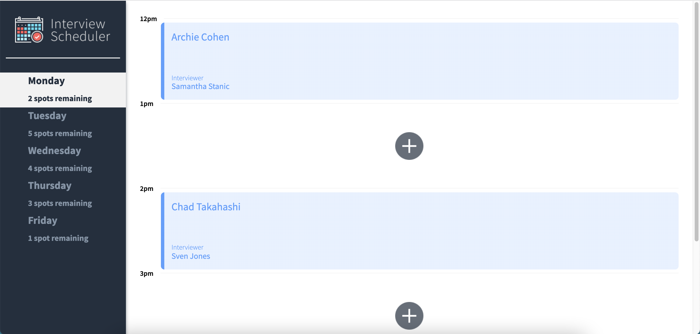

# Interview Scheduler
An interview scheduler app that lets a user book, edit and delete an appointment at a selected day and time.

- When booking an appointment, the user can type the student name and select a list of interviewers.
- When deleting an appointment, it will have a confirmation message first before fully deleting the appointment.
- A user can also edit the name of student/interviewer.
- The user can also see how many spots are remaining for the selected day.

Using the latest tools and techniques, we build and test a React application that allows users to book and cancel interviews. We combine a concise API with a WebSocket server to build a realtime experience.

## Screenshots:
Main Page


Booking an Appointment 
(after successfully booking an appointment - from 3 spots remaining, it became 2 spots remaining.)


Deleting an Appointment
(after successfully deleting an appointment - from 2 spots remaining, it became 3 spots remaining.)


Editing an Appointment


## Setup

Install dependencies with `npm install`.

## Running Webpack Development Server

```sh
npm start
```

## Running Jest Test Framework

```sh
npm test
```

## Running Storybook Visual Testbed

```sh
npm run storybook
```
